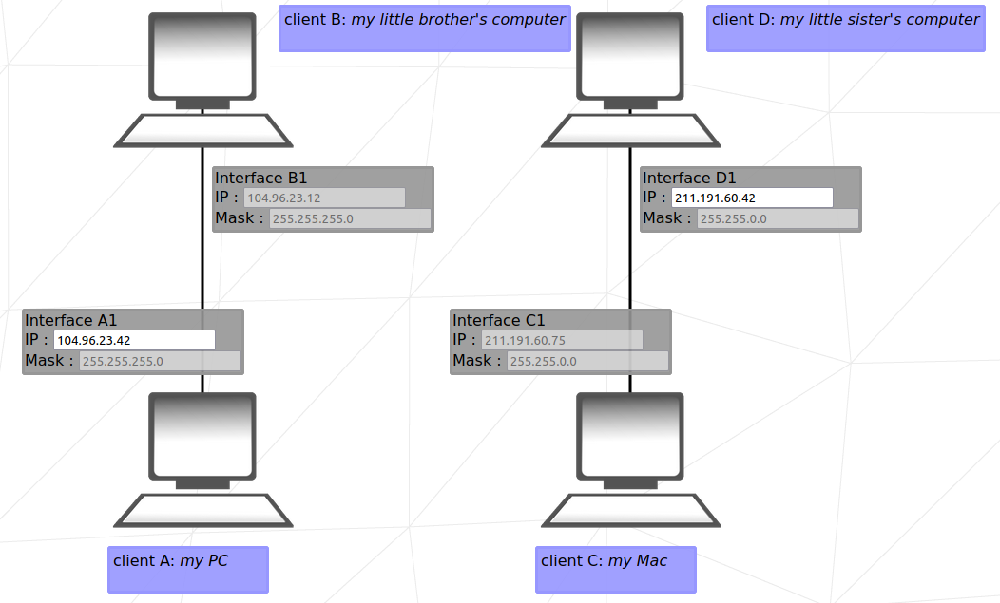

# 42-net-practice

## 🪧 Overview
🌐  NetPractice is a general practical exercise to let you discover networking. 

## 📷 Preview


## 🕹️ Usage
1. There are 10 levels available for training.
2. Complete the empty fields and click on button `Check again` to verify whether your configuration is correct or not.
3. Once the exercise is successful, click on button `Get my config` to download your configuration.
4. When you have successfully completed a level, click on button `Next level`.
5. Click [here](https://ricardoreves.github.io/42-net-practice/) to start training.

## 🧠 Networking Basics
### What is IP?
IP is a connectionless protocol that operates at the network layer of the OSI model. IP enables communication between hosts by carrying data within packets. Each host is assigned an IP address which is used to ensure that traffic is sent to the correct destination, synonymous in many ways to a postal address that we place on a letter.

An IP address (in the case of v4) is built upon 32-bits, expressed in four numbers known as octets. Each octet is 8 bits i.e one byte.
- `Network` - the network the IP address belongs to. For example the street name.
- `Host` - the host identifier of the device for the network. For example the house number.


### What is Subnet Mask?
A subnet mask is a 32-bit number created by setting host bits to all 0s and setting network bits to all 1s. In this way, the subnet mask separates the IP address into the network and host addresses.

The “255” address is always assigned to a broadcast address, and the “0” address is always assigned to a network address. Neither can be assigned to hosts, as they are reserved for these special purposes.


### Subnet Mask Chart
Here is a quick reference table for help when subnetting.
|Subnet Mask 	|CIDR |	Binary Notation| 	Network Bits| 	Host Bits| 	Available Addresses|
| -           | -   | -              | -            | -          | -                   | 
|255.255.255.255| 	/32| 	11111111.11111111.11111111.11111111| 	32| 	0| 	1|
|255.255.255.254| 	/31| 	11111111.11111111.11111111.11111110| 	31| 	1| 	2|
|255.255.255.252| 	/30| 	11111111.11111111.11111111.11111100| 	30| 	2| 	4|
|255.255.255.248| 	/29| 	11111111.11111111.11111111.11111000| 	29| 	3| 	8|
|255.255.255.240| 	/28| 	11111111.11111111.11111111.11110000| 	28| 	4| 	16|
|255.255.255.224| 	/27| 	11111111.11111111.11111111.11100000| 	27| 	5| 	32|
|255.255.255.192| 	/26| 	11111111.11111111.11111111.11000000| 	26| 	6| 	64|
|255.255.255.128| 	/25|     11111111.11111111.11111111.10000000| 	25| 	7| 	128|
|255.255.255.0| 	/24| 	11111111.11111111.11111111.00000000| 	24| 	8| 	256|		
|255.255.254.0| 	/23| 	11111111.11111111.11111110.00000000| 	23| 	9| 	512|
|255.255.252.0| 	/22| 	11111111.11111111.11111100.00000000| 	22| 	10| 	1024|
|255.255.248.0| 	/21| 	11111111.11111111.11111000.00000000| 	21| 	11| 	2048|
|255.255.240.0| 	/20| 	11111111.11111111.11110000.00000000| 	20| 	12| 	4096|
|255.255.224.0| 	/19| 	11111111.11111111.11100000.00000000| 	19| 	13| 	8192|
|255.255.192.0| 	/18| 	11111111.11111111.11000000.00000000| 	18| 	14| 	16384|
|255.255.128.0| 	/17| 	11111111.11111111.10000000.00000000| 	17| 	15| 	32768|
|255.255.0.0| 	/16| 	11111111.11111111.00000000.00000000| 	16| 	16| 	65536|	
|255.254.0.0| 	/15| 	11111111.11111110.00000000.00000000| 	15| 	17| 	131072|
|255.252.0.0| 	/14| 	11111111.11111100.00000000.00000000| 	14| 	18| 	262144|
|255.248.0.0| 	/13| 	11111111.11111000.00000000.00000000| 	13| 	19| 	524288|
|255.240.0.0| 	/12| 	11111111.11110000.00000000.00000000| 	12| 	20| 	1048576|
|255.224.0.0| 	/11| 	11111111.11100000.00000000.00000000| 	11| 	21| 	2097152|
|255.192.0.0| 	/10| 	11111111.11000000.00000000.00000000| 	10| 	22| 	4194304|
|255.128.0.0| 	/9| 	11111111.10000000.00000000.00000000| 	9| 	23| 	8388608|
|255.0.0.0| 	    /8| 	11111111.00000000.00000000.00000000| 	8| 	24| 	16777216| 

### Example
```
Address:   192.168.0.1           11000000.10101000.00000000 .00000001
Netmask:   255.255.255.0 = 24    11111111.11111111.11111111 .00000000
Wildcard:  0.0.0.255             00000000.00000000.00000000 .11111111
=>
Network:   192.168.0.0/24        11000000.10101000.00000000 .00000000 (Class C)
Broadcast: 192.168.0.255         11000000.10101000.00000000 .11111111
HostMin:   192.168.0.1           11000000.10101000.00000000 .00000001
HostMax:   192.168.0.254         11000000.10101000.00000000 .11111110
Hosts/Net: 254                   (Private Internet)
```

## 🧰 Tools
[IP Calculator](https://jodies.de/ipcalc) - ipcalc takes an IP address and netmask and calculates the resulting broadcast, network, Cisco wildcard mask, and host range.

## 📚 References
- [techtarget.com](https://www.techtarget.com/searchnetworking/tip/IP-addressing-and-subnetting-Calculate-a-subnet-mask-using-the-hosts-formula) - How to calculate a subnet mask from hosts and subnets
- [softwaretestinghelp.com](https://www.softwaretestinghelp.com/subnet-mask-and-network-classes/) - Guide to Subnet Mask (Subnetting) & IP Subnet Calculator

- [avinetworks.com](https://avinetworks.com/glossary/subnet-mask/) - Glossary Subnet mask
- [packetcoders.io](https://www.packetcoders.io/a-beginners-guide-to-subnetting/) - A Beginners Guide to Subnetting

## 📝 License
Distributed under the MIT License. See [LICENSE](LICENSE) for more information.
